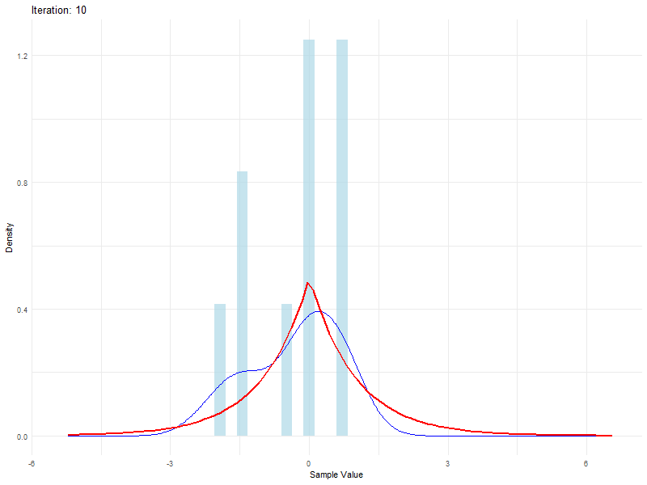

## ST2195 Coursework Project 2023-24

### Overview
This repository contains the coursework project for ST2195, focusing on the implementation and analysis of the Metropolis-Hastings algorithm and Flight Data Analysis.

### Part 1: Metropolis-Hastings Algorithm
- **Objective**: Implement the Metropolis-Hastings algorithm to simulate random samples from a Laplace distribution.

#### Outputs
- `Random_Walk_Metropolis.Rmd`: RMarkdown file containing the implementation and analysis.
- `Random_Walk_Metropolis.pdf`: PDF report of the analysis.
- `Random_Walk_Metropolis.ipynb`: Python Equivalent.
- `metropolis_iterations.gif`: Visualization of the sampling iterations.

### Part 2: Flight Data Analysis
- **Objective**: Analyze flight arrival and departure data to identify patterns and factors affecting delays.

---

### Repository Structure
- `iteration_gif.R`: Script to generate the GIF for sampling iterations.
- `metropolis_iterations.gif`: GIF visualizing the sampling iterations.
- `ST2195 Coursework Project.pdf`: Full assignment description.
- `Statistical Background.docx`: Background document for statistical analysis.
- `220692829_ST2195`: Structured Report (Part 1 Only)
- `Flight_Data_Analysis.pdf`: Markdown PDF (Part 2a Only)
- `part2b.Rmd`: Markdown PDF (Part 2b Partial)

### How to Run
1. Open the RMarkdown (`.Rmd`) file in RStudio, located Part 1 > Random_Walk_Metropolis.Rmd
2. Knit the document to produce the PDF report.
3. Open the RMarkdown (`.Rmd`) file in RStudio, located Part 2 > Flight_Data_Analysis.Rmd
4. Uncomment line 44 for the initial run, to convert compressed csv files into Parquet files.
5. Knit the document to produce the PDF report.
